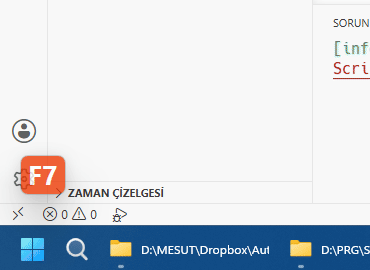
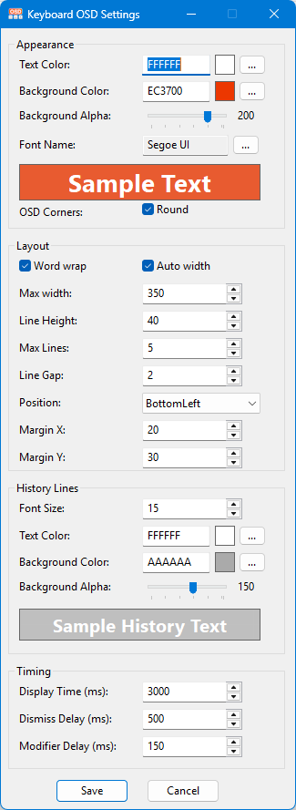

# Keyboard OSD

Keyboard OSD is a lightweight Windows utility that displays keyboard input and shortcut combinations on screen in real time. It is designed for presentations, tutorials, screen recordings, and live demonstrations where visible keystrokes make the workflow easier to follow.

## Features

- Shows typed text, special keys, and shortcut combinations as an on-screen display.
- Groups repeated key presses with a counter.
- Keeps recent key history on multiple OSD lines.
- Supports optional word wrapping for typed text.
- Handles Backspace naturally while typing by removing the last visible character.
- Supports common modifiers such as Ctrl, Shift, Alt, Win, and AltGr.
- Uses a click-through overlay so the OSD does not block the active window.
- Automatically positions the OSD on the monitor that contains the active window.
- Includes a settings window for colors, font, size, transparency, position, margins, line spacing, and display timing.
- Saves settings to `settings.ini`.
- **Icons are now embedded in the executable** no external icon files needed for compiled version.

## Requirements

- Windows
- For the compiled release: no AutoHotkey installation is required.
- For running from source: [AutoHotkey v2](https://www.autohotkey.com/) is required.

## Files

- `keyboard-osd.ahk` - main script
- `settings-gui.ahk` - settings window
- `commonDialog.ahk` - color and font dialog helpers
- `settings.ini` - user settings
- `app_icon.ico` - application tray icon used when the OSD is active (source version only)
- `app_icon_pause.ico` - application tray icon used when the OSD is paused (source version only)

## Usage

### Download the compiled version

1. Open the [Releases](https://github.com/mesutakcan/Keyboard-OSD/releases) page.
2. Download the latest `.exe` file.
3. Run the executable.
4. Press keys or shortcuts to see them on screen.

> **Note:** The compiled executable contains all required icons internally. You can move it anywhere without worrying about missing icon files.

### Run from source

1. Install AutoHotkey v2.
2. Download or clone this repository.
3. Run `keyboard-osd.ahk`.
4. Press keys or shortcuts to see them on screen.

The application runs in the system tray. Right-click the tray icon to open:

- `About` - show application and author information
- `GitHub Repository` - open the project page
- `Settings` - edit the OSD appearance and behavior
- `Reload` - reload the script
- `Pause OSD` - pause or resume the OSD
- `Exit` - close the application

## Settings

Most options can be changed from the settings window:

- Text and background colors
- Background transparency
- Font family, size, and style
- Auto width or fixed width
- Word wrap for typed text
- Maximum visible lines
- OSD position and margins
- Line height and spacing
- Display duration and dismiss animation timing
- Modifier key delay
- History line appearance

After saving settings, the script reloads automatically to apply the changes.

## Notes

- The script is intended for AutoHotkey v2 and will not run correctly on AutoHotkey v1.
- The OSD follows the active monitor's work area, excluding the taskbar.
- Some keyboard behavior may depend on the active keyboard layout.
- When running the compiled version, icons are embedded in the executable. When running from source, external icon files are required.

## History

### Version 1.1 (2026-06-26)

**New:**
- Icons are now embedded directly into the compiled executable (Resource IDs: 100 and 101)
- Improved portability the `.exe` file now works standalone without requiring external icon files

**Fixes:**
- Fixed tray icon not displaying correctly in compiled executable
- Fixed pause icon switching when script is paused

**Technical:**
- Added `;@Ahk2Exe-AddResource` compiler directives to embed icons
- Updated `TraySetIcon` calls to use embedded resources when running as compiled executable
- Added `A_IsCompiled` conditional logic for icon loading

### Version 1.0 (2026-06-24)

- Initial release
- Real-time keyboard input display
- Support for shortcuts and modifier keys
- Customizable appearance and behavior
- Settings window with live preview

## License

This project is licensed under the GPL 3.0 License. For more information, see the `LICENSE` file.

## Contributing

Contributions are welcome! If you'd like to add features, fix bugs, or improve the code, feel free to open a pull request.

## Contact

**Author**: Mesut Akcan\
**Email**: <makcan@gmail.com>\
**Blog**: [mesutakcan.blogspot.com](http://mesutakcan.blogspot.com)\
**GitHub**: [mesutakcan](http://github.com/mesutakcan)
