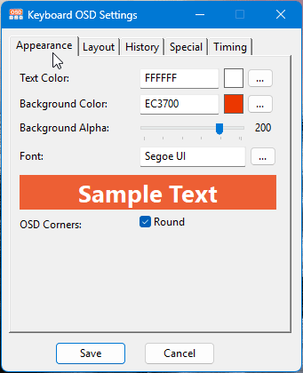

# Keyboard OSD

Keyboard OSD is a lightweight Windows utility that displays keyboard input and shortcut combinations on screen in real time. It is designed for presentations, tutorials, screen recordings, and live demonstrations where visible keystrokes make the workflow easier to follow.

## Features

- Shows your typed text and shortcut combinations on screen in real time.
- Shortcuts and modifier keys (like `Ctrl+C` or `Shift`) appear as eye-catching badges, clearly separated from regular typed text.
- Repeated key presses are grouped together with a counter instead of cluttering the screen.
- Keeps a short history of recent keys, with each line fading out on its own timer.
- Optional word wrap for longer typed text, and natural Backspace handling while typing.
- Works with common modifiers: Ctrl, Shift, Alt, Win, and AltGr.
- Click-through overlay — it never gets in the way of the window you're working in.
- Automatically follows the active window to the correct monitor.
- Fully customizable from a settings window: colors, fonts, size, transparency, position, margins, padding, and timing — all with a live preview.
- Smooth fade-out animations and optional rounded corners.
- History lines can have their own font size, colors, and transparency, separate from the active line.
- Pause and resume anytime with **`Ctrl+Shift+F8`** or from the tray menu.
- Compiled version is a single portable `.exe` — no separate icon files or installation needed.

## Requirements

- Windows
- For the compiled release: no AutoHotkey installation is required.
- For running from source: [AutoHotkey v2](https://www.autohotkey.com/) is required.

## Files

| File | Description |
|---|---|
| `keyboard-osd.ahk` | Main script — key watcher, OSD rendering, state management, tray menu |
| `lib.ahk` | Helper library — text measurement (GDI), badge rendering (GDI+), monitor detection, fade animation, window helpers, INI read |
| `settings-gui.ahk` | Settings window with tabbed layout and live preview |
| `commonDialog.ahk` | Windows standard Font (ChooseFontW) and Color (ChooseColorW) dialog wrappers |
| `settings.ini` | User settings (auto-created on first save) |
| `app_icon.ico` | Tray icon — active state (source version only) |
| `app_icon_pause.ico` | Tray icon — paused state (source version only) |

## Usage

### Download the compiled version

1. Open the [Releases](https://github.com/mesutakcan/Keyboard-OSD/releases) page.
2. Download the latest `.exe` file.
3. Run the executable.
4. Press keys or shortcuts to see them on screen.

> **Note:** The compiled executable contains all required icons internally. You can move it anywhere without worrying about missing icon files.

### Run from source

1. Install AutoHotkey v2.
2. Download or clone this repository.
3. Run `keyboard-osd.ahk`.
4. Press keys or shortcuts to see them on screen.

The application runs in the system tray. Right-click the tray icon to open:

- `About` — show application and author information
- `GitHub Repository` — open the project page
- `Settings` — edit the OSD appearance and behavior
- `Reload` — reload the script
- `Pause OSD` — pause or resume the OSD
- `Exit` — close the application

You can also toggle pause with the keyboard shortcut **`Ctrl+Shift+F8`**.

## Settings

All options can be changed from the tabbed settings window. Changes are saved to `settings.ini` and the script reloads automatically to apply them.

### Appearance
- Text and background colors (Windows color picker)
- Background transparency (alpha)
- Font family, size, bold, italic, underline, strikeout (Windows font picker)
- Rounded window corners (on/off)

### Layout
- Auto width or fixed maximum width
- Word wrap for typed text
- Maximum visible lines
- Line gap between rows
- OSD position: TopLeft, TopCenter, TopRight, BottomLeft, BottomCenter, BottomRight
- Margin X / Margin Y from the screen edge
- Padding X, Padding Y Top, Padding Y Bottom inside each row

### History
- History line font size
- History text and background colors
- History background transparency

### Special
Controls the appearance of shortcut and modifier key badges (e.g. `Ctrl+C`, `Shift`, `Escape`, `Tab`):

- Border color, fill color, text color
- Badge transparency (alpha)
- Border width
- Text padding inside the badge
- Text Y nudge (fine-tune vertical text position)

### Timing
- Display duration (ms) — how long the active line stays on screen
- Dismiss delay (ms) — how long each history line stays before fading out
- Modifier delay (ms) — how long to wait before showing a lone modifier key press

## Notes

- The script requires AutoHotkey v2 and will not run on AutoHotkey v1.
- The OSD follows the active monitor's work area, excluding the taskbar.
- Line height is calculated automatically from the actual GDI font metrics; it is not a manual setting.
- Badge bitmaps for special keys are rendered using GDI+ and cached for performance.
- Some keyboard behavior may depend on the active keyboard layout.
- When running the compiled version, icons are embedded in the executable (main icon via `SetMainIcon`, pause icon as Resource ID 207). When running from source, `app_icon.ico` and `app_icon_pause.ico` must be present in the script directory.
- Font and text width measurement use the Windows GDI API for pixel-accurate results.

## History

### Version 1.4 (2026-07-11)

**New:**
- Shortcut and modifier key presses now appear as styled badges with a rounded border, fill color, and their own transparency — making them instantly stand out from regular typed text.
- Added a new **Special** tab in the settings window to customize badge colors, border, padding, and text position, with a live preview.
- Badge rendering is now cached, keeping the OSD smooth even with frequent shortcut presses.

---

### Version 1.3 (2026-07-02)

**Architecture:**
- Refactored into `OSDSettings` and `OSDState` classes for cleaner state management.
- Extracted all helper functions into a dedicated `lib.ahk` file.
- INI file reorganized into four named sections: `[Appearance]`, `[Layout]`, `[History]`, `[Timing]`.

**New:**
- Each OSD line is now an `OSDLine` object with its own `CreatedAt` timestamp, repeat counter, and `IsExpired()` check — active line and history lines expire independently.
- Non-blocking per-row fade system using `FadingStates` / `FadeTimers` arrays.
- `CheckExpiredLines` timer replaces the `StartDismiss` / `DismissNext` chain.
- `FlushTypingTimeout` — typed text is automatically committed after `DisplayTime` ms of inactivity.
- `MeasureTextHeight` — line height is now calculated from real GDI font metrics.
- Pause/resume keyboard shortcut `Ctrl+Shift+F8`.
- Settings GUI switched from GroupBox layout to a tabbed layout.
- Added `PaddingX`, `PaddingYTop`, `PaddingYBottom` layout settings.

**Fixes:**
- Fade no longer blocks the key watcher thread.

---

### Version 1.2 (2026-06-28)

**New:**
- OSD windows now fade out smoothly when dismissed instead of disappearing instantly.

---

### Version 1.1 (2026-06-26)

**New:**
- Icons are now embedded directly into the compiled executable.
- Improved portability — the `.exe` file now works standalone without requiring external icon files.

**Fixes:**
- Fixed tray icon not displaying correctly in compiled executable.
- Fixed pause icon switching when script is paused.

---

### Version 1.0 (2026-06-24)

- Initial release.
- Real-time keyboard input display.
- Support for shortcuts and modifier keys.
- Customizable appearance and behavior.
- Settings window with live preview.

## License

This project is licensed under the GPL 3.0 License. For more information, see the `LICENSE` file.

## Contributing

Contributions are welcome! If you'd like to add features, fix bugs, or improve the code, feel free to open a pull request.

## Contact

**Author**: Mesut Akcan\
**Email**: <makcan@gmail.com>\
**Blog**: [mesutakcan.blogspot.com](http://mesutakcan.blogspot.com)\
**YouTube**: [youtube.com/mesutakcan](http://youtube.com/mesutakcan)\
**GitHub**: [mesutakcan](http://github.com/mesutakcan)
