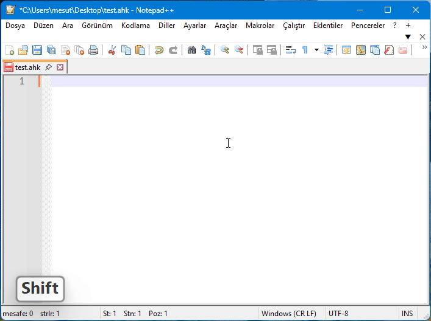
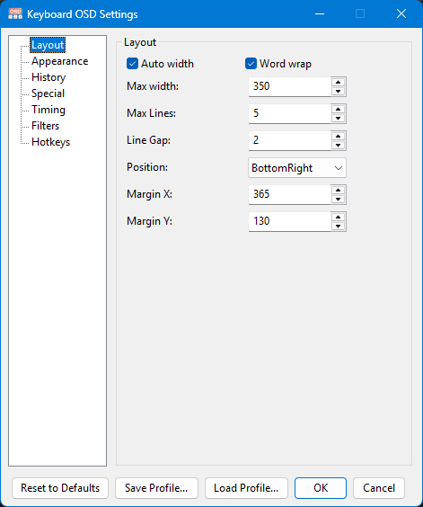
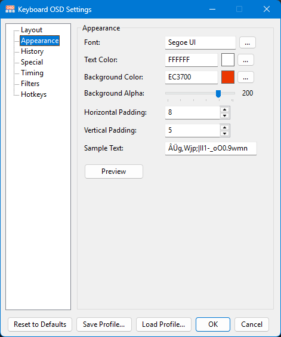
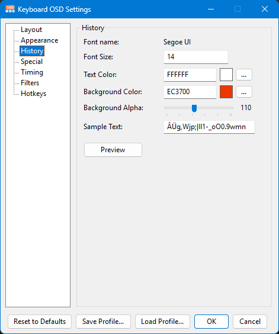
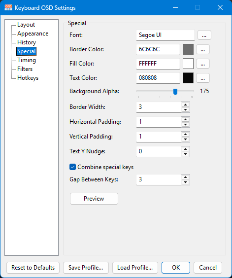
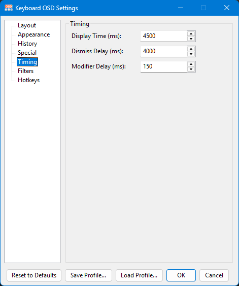

# Keyboard OSD

[](https://www.autohotkey.com/) [](https://www.microsoft.com/windows) [](https://github.com/mesutakcan/Keyboard-OSD/blob/main/LICENSE) [](https://github.com/mesutakcan/Keyboard-OSD/releases)

[](https://github.com/mesutakcan/Keyboard-OSD) [](https://github.com/mesutakcan/Keyboard-OSD) [](https://github.com/mesutakcan/Keyboard-OSD) [](https://github.com/mesutakcan/Keyboard-OSD/releases)

Keyboard OSD is a lightweight Windows utility that shows keyboard input and shortcut combinations on screen in real time. It's made for presentations, tutorials, screen recordings, and live demos where visible keystrokes help the viewer follow along.

[](docs/ss_keyboard_osd.gif)

Keyboard OSD demo video: https://youtu.be/UvLldgMmC-Q

## Features

- Shows your typed text and shortcut combinations on screen in real time.
- Shortcuts and modifier keys (like <kbd>Ctrl+C</kbd> or <kbd>Shift</kbd>) show up as badges, clearly separated from regular typed text.
- Repeated key presses are grouped with a counter instead of piling up on screen.
- Multiple shortcuts pressed back to back can combine into a single row (e.g. <kbd>Ctrl</kbd> then <kbd>PgDn</kbd>), instead of each one taking its own line.
- Keeps a short history of recent keys, with each line fading out on its own timer.
- Optional word wrap for longer typed text, and natural backspace handling while typing.
- Pressing <kbd>Enter</kbd> while typing sends the line to history right away, instead of waiting for it to time out.
- Works with common modifiers: <kbd>Ctrl</kbd>, <kbd>Shift</kbd>, <kbd>Alt</kbd>, <kbd>Win</kbd>, and AltGr.
- Click-through overlay - it never gets in the way of the window you're working in.
- Automatically follows the active window to the correct monitor.
- Fully customizable from a settings window: colors, fonts, size, transparency, position, margins, padding, and timing, all with a live preview.
- Smooth fade-out animations and rounded corners on every row.
- History lines use the same font as the active line, at their own size, with their own colors and transparency.
- Pause and resume anytime with a hotkey you set yourself, or from the tray menu.
- Filter unwanted key categories or individual key combinations from the OSD.
- Configure the pause and hide-OSD hotkeys from the settings window, with quick capture and a clear button.
- Save your settings as a named profile and load a different one later, or reset everything back to defaults.
- Can be hidden by another script or application, without simulating a keypress, handy for screen recording setups.
- Compiled version is a single portable `.exe`, no separate icon files or installation needed.

## Requirements

- Windows
- For the compiled release: no AutoHotkey installation is required.
- For running from source: [AutoHotkey v2](https://www.autohotkey.com/) is required.

## Files

| File                 | Description                                                                |
| -------------------- | -------------------------------------------------------------------------- |
| `keyboard-osd.ahk`   | Main script - handles the tray menu and displays your keystrokes on screen |
| `render.ahk`         | Drawing code: turns each row into an image and puts it on screen           |
| `keyfilter.ahk`      | Decides which key presses count as typing and which ones get filtered out  |
| `gdip.ahk`           | Small drawing helper library used by `render.ahk`                          |
| `settings-gui.ahk`   | The settings window, with live preview                                     |
| `commonDialog.ahk`   | Windows font and color picker windows                                      |
| `GroupBox.ahk`       | Group box control used by the settings window                              |
| `hotkeyplus.ahk`     | Hotkey capture control used on the Hotkeys and Filters settings pages      |
| `settings.ini`       | Your saved settings (created automatically the first time you save)        |
| `app_icon.ico`       | Tray icon shown while the OSD is active (source version only)              |
| `app_icon_pause.ico` | Tray icon shown while the OSD is paused (source version only)              |

## Usage

### Download the compiled version

1. Open the [Releases](https://github.com/mesutakcan/Keyboard-OSD/releases) page.
2. Download the latest `.exe` file.
3. Run the executable.
4. Press keys or shortcuts to see them on screen.

> **Note:** The compiled executable has all required icons built in. You can move it anywhere without worrying about missing icon files.

### Run from source

1. Install AutoHotkey v2.
2. Download or clone this repository.
3. Run `keyboard-osd.ahk`.
4. Press keys or shortcuts to see them on screen.

The application runs in the system tray. Right-click the tray icon to open:

- `About` - show application and author information
- `GitHub Repository` - open the project page
- `Settings` - edit the OSD appearance and behavior
- `Reload` - reload the script
- `Pause OSD` - pause or resume the OSD
- `Hide OSD` - hide all visible OSD rows
- `Exit` - close the application

You can also toggle pause or hide the OSD with the hotkeys you set on the **Hotkeys** settings page.

## Settings

All options can be changed from the settings window, organized into categories in the sidebar. Changes are saved to `settings.ini` and applied after you restart the script.

### Layout

- Auto width or fixed maximum width
- Word wrap for typed text
- Maximum visible lines
- Line gap between rows
- OSD position: TopLeft, TopCenter, TopRight, BottomLeft, BottomCenter, BottomRight, Center
- Margin X / Margin Y from the screen edge



### Appearance

- Text and background colors (Windows color picker)
- Background transparency (alpha)
- Font family, size, bold, italic (Windows font picker)
- Horizontal and vertical padding



### History

- History line font size (uses the same font family and weight as Appearance)
- History text and background colors
- History background transparency



### Special

Controls the appearance of shortcut and modifier key badges (e.g. <kbd>Ctrl+C</kbd>, <kbd>Shift</kbd>, <kbd>Escape</kbd>, <kbd>Tab</kbd>):

- Border color, fill color, text color
- Badge transparency (alpha)
- Border width
- Text padding inside the badge
- Text Y nudge (fine-tune vertical text position)
- Combine multiple shortcuts pressed in a row into one badge group, with adjustable gap between them



### Timing

- Display duration (ms) - how long the active line stays on screen
- Dismiss delay (ms) - how long each history line stays before fading out
- Modifier delay (ms) - how long to wait before showing a lone modifier key press



### Filters

- Function keys (F1-F24), Numpad, English letters, digits, arrow keys, and navigation keys
- Other letters, by entering the characters to exclude
- Modifiers alone or as part of a combination
- Custom key combinations, managed with an add/remove list


### Hotkeys

- Set the hotkey for pausing or resuming the OSD
- Set the hotkey for hiding all visible OSD rows
- Click into the box and press a key combination to capture it directly - only keyboard keys are accepted, mouse buttons are not


### Profiles

- Save your current settings as a named profile file
- Load a previously saved profile back into the form
- Reset the form to the built-in defaults

None of these apply until you click OK, so you can try a profile or reset the form and back out without losing your current setup.

## Hiding the OSD from another application

If you record your screen with a separate tool, you may want that tool to hide the OSD on its own, for example right before it starts or stops recording, without sending a fake keypress to your system.

Keyboard OSD listens for a Windows message for this. Any other script or application can send message `0x5555` to the Keyboard OSD window to hide all visible rows instantly:

```ahk
PostMessage(0x5555, 0, 0, , "Keyboard OSD")
```

This hides the OSD directly at the window level, so it works even while the OSD window is click-through and out of focus.

## Notes

- Running from source requires AutoHotkey v2; it will not work with the older AutoHotkey v1.
- The OSD automatically appears on whichever monitor your active window is on, and stays clear of the taskbar.
- Row height adjusts automatically to your chosen font, so text is never cropped or oddly spaced.
- Saving settings asks if you want to restart right away. If you choose not to, Keyboard OSD reminds you the next time you open Settings, so your saved changes are never silently left unapplied.
- Some very old or bitmap-style fonts (for example Fixedsys) cannot be drawn by this app. Settings will warn you if the font you picked can't be used.
- Keystroke display may vary slightly depending on your active keyboard layout.
- The compiled `.exe` has all icons built in, so it works standalone. When running from source, keep `app_icon.ico` and `app_icon_pause.ico` in the same folder as the script.

## History

### Version 1.8 (2026-09-13)

- Rows are now drawn as images instead of native text controls, removing the small flicker that could happen while typing quickly.
- Multiple shortcuts pressed one after another can combine into a single badge row (e.g. <kbd>Ctrl</kbd> then <kbd>PgDn</kbd> shown together), with an option to turn this off and a gap size you can adjust.
- Pressing <kbd>Enter</kbd> while typing now sends the line to history immediately, instead of waiting for the display timer to run out.
- Added **Save Profile** and **Load Profile** to the settings window, so you can keep more than one setup and switch between them.
- Added **Reset to Defaults**, which resets the settings form without touching your saved file until you click OK.
- Saving settings now asks whether to restart immediately or later; if you pick later, Keyboard OSD reminds you the next time Settings is opened.
- History lines now always follow the Appearance font family and weight, only the size is set separately. This removes a font mismatch that could happen when only one of the two was changed.
- Removed the rounded-corners on/off setting - every row now always has rounded corners.
- Removed the Text Y Nudge option from Appearance and History; padding alone now positions the text correctly. It's still available under Special for fine-tuning shortcut badges.
- Default pause and hide hotkeys changed to <kbd>Ctrl+Shift+F12</kbd> and <kbd>Ctrl+Shift+F9</kbd>.
- Settings window warns you up front if a chosen font can't be drawn, instead of showing blank text later.

**Fixes:**

- Fixed a saved setting occasionally resetting the OSD position back to its default after reopening the app.
- Fixed a modifier key badge (e.g. <kbd>Ctrl</kbd>) sometimes staying on screen longer than it should when typing started right after it.

---

### Version 1.7 (2026-09-04)

- Hotkeys and custom key combinations are now captured with a dedicated control instead of the built-in Windows hotkey box, with a clearer display and a button to clear the current value.
- Only keyboard keys can be assigned as hotkeys or exclusion combinations - mouse buttons are no longer accepted, to keep behavior focused on keyboard input.

---

### Version 1.6 (2026-08-26)

- Added a **Filters** settings page for excluding key categories, individual characters, modifiers, and custom key combinations.
- Added a **Hotkeys** settings page for configuring the pause/resume and hide-OSD shortcuts.
- Added a **Hide OSD** tray command and hotkey to instantly hide all visible rows.
- Added an option to keep shortcut and modifier badge styling when lines move into history.
- Settings window navigation redesigned: a category list on the left replaces the old tabs.

**Fixes:**

- Fixed occasional flickering while typing.

---

### Version 1.5 (2026-07-15)

- The Windows (<kbd>Win</kbd>) key can now be shown on its own as a badge, just like <kbd>Ctrl</kbd>, <kbd>Shift</kbd>, and <kbd>Alt</kbd>.
- Improved AltGr and <kbd>Shift</kbd> handling: when a key combination produces a character, that character now appears in the typed text as expected. When it doesn't produce a character, the badge shows the key combination itself (e.g. AltGr + K).
- Holding down multiple modifier keys in sequence now updates the badge smoothly to show the full combination, instead of showing a separate badge for each stage.

**Fixes:**

- A lone modifier badge (e.g. just <kbd>Shift</kbd>) no longer lingers on screen after you start typing.

---

### Version 1.4 (2026-07-11)

- Shortcut and modifier key presses now appear as styled badges with a rounded border, fill color, and their own transparency, making them instantly stand out from regular typed text.
- Added a new **Special** tab in the settings window to customize badge colors, border, padding, and text position, with a live preview.
- Smoother performance when pressing shortcuts frequently.

---

### Version 1.3 (2026-07-02)

- Active line and history lines now disappear independently, each on its own timer, for more natural timing.
- Row fade-outs are smoother and no longer interrupt typing while they play.
- Typed text is now automatically finalized after a short pause, instead of waiting indefinitely.
- Row height is now calculated automatically from your chosen font, so text always fits cleanly.
- Added a pause/resume keyboard shortcut: <kbd>Ctrl+Shift+F8</kbd>.
- Settings window redesigned with a cleaner tabbed layout.
- Added fine-grained padding controls for each row (left/right, top, bottom).

**Fixes:**

- Fade animations no longer cause typing to lag or stutter.

---

### Version 1.2 (2026-06-28)

- OSD windows now fade out smoothly when dismissed instead of disappearing instantly.

---

### Version 1.1 (2026-06-26)

- Icons are now embedded directly into the compiled executable.
- Improved portability - the `.exe` file now works standalone without requiring external icon files.

**Fixes:**

- Fixed tray icon not displaying correctly in compiled executable.
- Fixed pause icon switching when script is paused.

---

### Version 1.0 (2026-06-24)

- Initial release.
- Real-time keyboard input display.
- Support for shortcuts and modifier keys.
- Customizable appearance and behavior.
- Settings window with live preview.

## License

This project is licensed under the GPL 3.0 License. For more information, see the `LICENSE` file.

## Contributing

Contributions are welcome! If you'd like to add features, fix bugs, or improve the code, feel free to open a pull request.

## Credits

Keyboard OSD builds on a few other open-source projects:

- [GroupBox](https://github.com/mesutakcan/GroupBox) by Mesut Akcan - the container control used to group settings on each page.
- [HotkeyPlus](https://github.com/mesutakcan/hotkeyplus-ahk) by Mesut Akcan - the hotkey capture control used on the Hotkeys and Filters pages.
- [AHKv2-Gdip](https://github.com/buliasz/AHKv2-Gdip) by buliasz - `gdip.ahk` is a trimmed-down copy of this library, keeping only the drawing functions Keyboard OSD needs.

## Contact

**Author**: Mesut Akcan\
**Email**: <makcan@gmail.com>\
**Blog**: [mesutakcan.blogspot.com](http://mesutakcan.blogspot.com)\
**YouTube**: [youtube.com/mesutakcan](http://youtube.com/mesutakcan)\
**GitHub**: [mesutakcan](http://github.com/mesutakcan)
